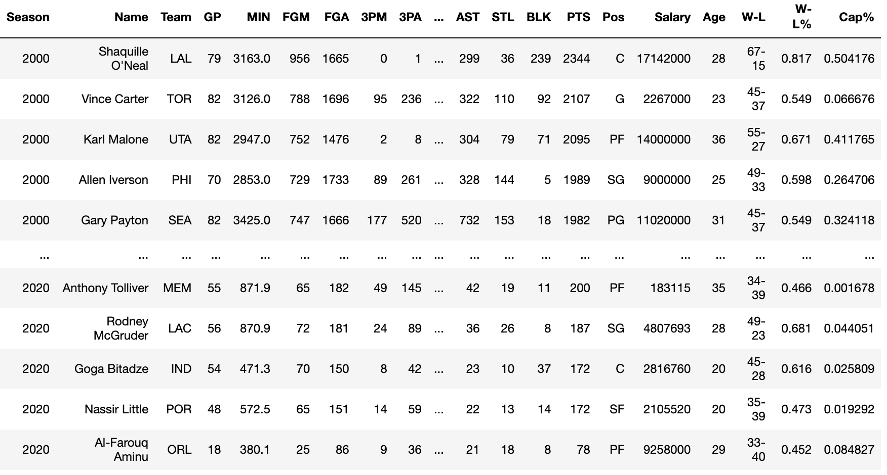

# NBA Salary Prediction
Ariel Liberzon
### Objective
Use NBA statistics to predict an NBA player's salary and use the residual to determine if a player was undervalued or overvalued that season

### Datasets Used:

Biometric, biographic and basic box score features from 1996 to 2020 season  
https://www.kaggle.com/justinas/nba-players-data

NBA player salaries per season (2000 - 2021)  
https://github.com/erikgregorywebb/datasets/blob/master/nba-salaries.csv

Every NBA team's regular season record (1946 - 2016)  
https://data.world/gmoney/nba-team-records-by-year/workspace/file?filename=Historical+NBA+Performance.xlsx

Used to manually fill in team records from (2017 - 2020)  
https://www.landofbasketball.com/nba_teams.htm

Basketball Players Stats per Season - 49 Leagues 
https://www.kaggle.com/jacobbaruch/basketball-players-stats-per-season-49-leagues

### Data
Based on the datasets I could find, I decided to use data between 2000 and 2020. I figured the last 20 years was good sample size since it had 2 generations of players, marked the end of the Chicago Bulls dynasty, and included all 30 teams for the most part (Charlotte Bobcats were added in 2004).

All of the data listed above was cleaned up and then imported into a Dataframe. Players who did not have their salary information were removed along with players who did not play for more than 10 games a season (teams can offer players 10-day contracts to assess their skill). Players that were traded mid-season were listed under their most recent team that year. For consistency, all data used the latter year to represent the seaon (ex: 2003-04 would be 2004).

### NBA Salary Cap
The NBA salary cap is the limit to the total amount of money that NBA teams are allowed to pay their players. The graph below shows that the salary cap has increased over the years. Given this increase, we should adjust our player salary to the salary cap that season.

### NBA Average Player Salary per Year
Despite the gradual increase in the salary cap, the graph below shows some irregularities. It's most likley that the majority of the early 2000's players in the data set were high-profile players. There are a few graphs online that show that the average salary gradually increased throughout the years similarly to the salry cap.
https://runrepeat.com/salary-analysis-in-the-nba-1991-2019

If we count the number of entries per year we can that, as predicted, the early 2000's (00-05) entries are inconsistent in comparison to the following years.

## Salary & Statistics
We can use a heat map to explore the relationship between each category in our dataset. However, given the number of features it can be hard to tell which are relevant.

### Example of correlated features

Earlier I tried using a dataset that had statistical features while this one focused on raw data 

## Training/Fitting Model
Instead of predicting the player salary, I decided to predict the salary cap percentage of their salary. This eliminated the need to adjust for inflation.

I decided to go with a Random Forest Regression because it had performed slightly better than Linear Regression. Note that one glaring problem with the result is the residual bias (seen in the 2nd graph)

I added the prediction back to the dataframe and the residual (actual - prediction). This was used to determine if a player was overvalued (positive) or undervalued (negative) that season

Top overvalued players:

Top undervalued players:

The results show that the most overvalued players are superstars past their prime. The most undervalued players are emerging superstars in the end of their rookie contracts

If we include a players age as a feature in our model (despite it being more categorical), the results focus less on rookies and more on veteran players that performing well on minimum contracts

Top overvalued players (adjusted):

Top undervalued players (adjusted):

## Conclusion

Although the model used was not perfect it proved to be a helpful tool in measuring the value of a player their performance in a particular season